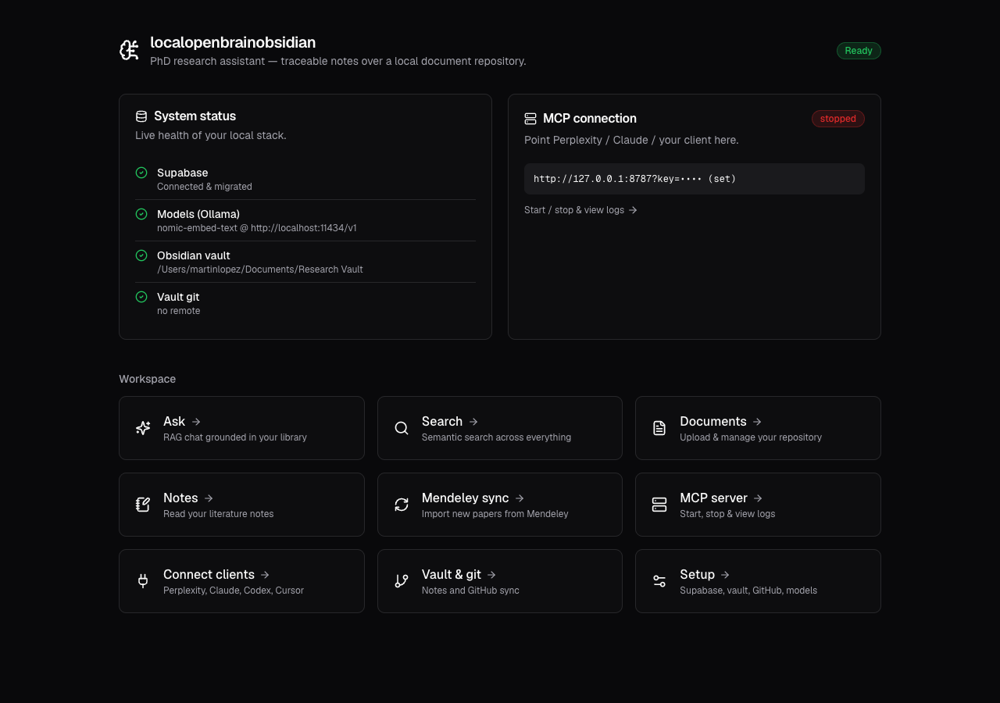
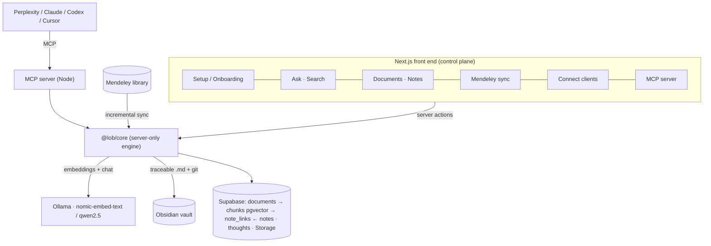
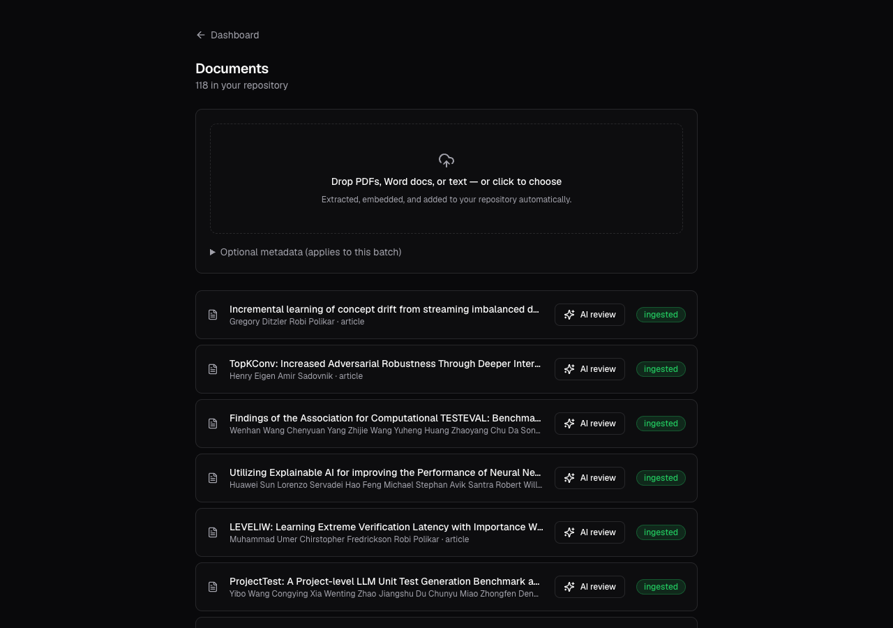
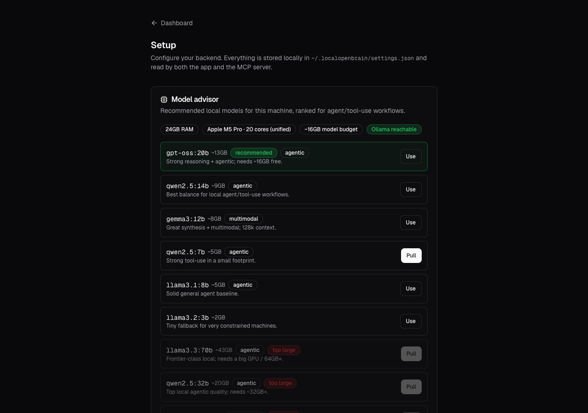
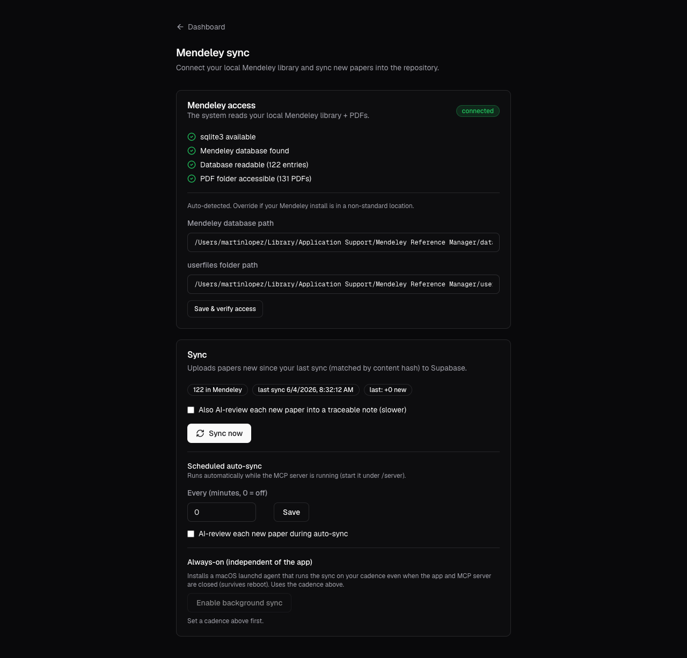
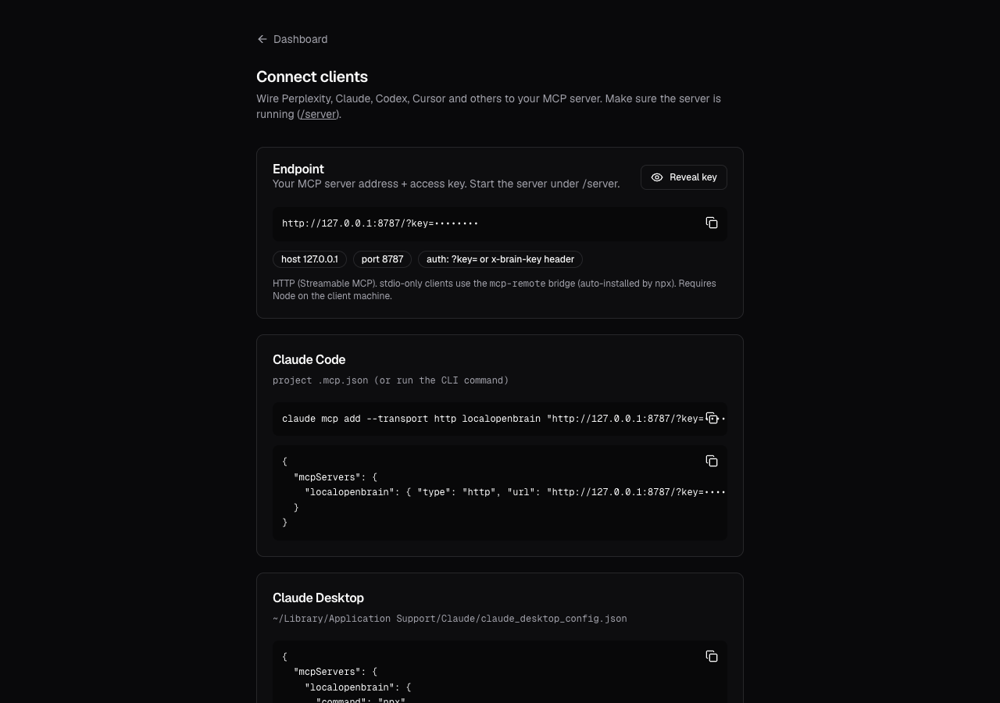

# localopenbrainobsidian

A local-first **PhD research assistant + second brain**. Review journal articles with
Perplexity / Ollama / any MCP client, write the findings **directly into your Obsidian vault as
Markdown**, and keep every note **traceable back to the exact source passage** through a managed
document repository with RAG.

> Runs **fully local** (Supabase + Ollama + your vault on your machine) and is **hosted-ready** —
> point it at managed Supabase by swapping credentials, no code changes. Nothing is hardcoded;
> a new user is guided through setup on first launch.



## What it does

- **Document repository** — upload PDFs/Word/Markdown (or sync your Mendeley library); they're
  parsed, chunked, embedded into Supabase + pgvector, and stored in Supabase Storage.
- **Claim-level traceability** — AI-review a paper or ask a question, and every claim in the
  resulting Obsidian note links to the **exact source passage** (chunk). Navigate note → passage,
  passage → document, document → every note that cites it.
- **RAG chat & search** — ask your library in natural language; a local model answers grounded in
  retrieved passages with inline citations, and you can save the answer as a traceable note.
- **Model-agnostic + hardware-aware** — OpenAI-compatible client (local Ollama by default). A
  built-in advisor detects the machine (RAM / GPU / VRAM) and recommends + one-click-pulls a model
  suited to agent workflows.
- **Connect any MCP client** — generated configs for Claude Code, Claude Desktop, Cursor, Codex,
  Perplexity.
- **Autonomous** — scheduled Mendeley sync (in-app heartbeat or always-on launchd agent) and vault
  GitHub sync.

## Architecture



The traceability spine is `documents → chunks → note_links ← notes` (see
`supabase/migrations/0001_init.sql`). The same `@lob/core` engine powers the web UI, the MCP
server, and the CLIs — so a paper uploaded in the browser and one registered by Perplexity are
identical, and "a grounded, cited claim" means the same thing everywhere.

## Screenshots

| Documents repository | Model advisor (hardware-aware) |
|---|---|
|  |  |

| Mendeley sync + scheduling | Connect MCP clients |
|---|---|
|  |  |

## Repo layout

```
packages/core/        @lob/core — settings, config, db, embeddings, vault, rag,
                      documents (process/review/ask), integrations/mendeley,
                      process (mcp/launchd), system/hardware, storage, setup
apps/mcp-server/      @lob/mcp-server — Node MCP server + CLIs (setup, ingest, sync)
apps/web/             @lob/web — Next.js 15 + React 19 + Tailwind dashboard
supabase/             config.toml (local stack) + migrations/0001_init.sql
```

## Quickstart

```bash
npm install
ollama pull nomic-embed-text          # embeddings (768-dim)
supabase start && supabase db reset   # local Postgres+pgvector+Storage + schema
npm run start:app                     # Docker → Supabase → web, opens http://research-assistant
```

`npm run start:app` (or double-click **`research-assistant.command`** on macOS) brings everything
up and opens the app at a friendly hostname — **http://research-assistant** (a one-time `/etc/hosts`
alias to 127.0.0.1; sudo once). Override with `RA_HOST` / `RA_PORT`, or `RA_HOST=localhost` to skip
the alias. (`npm run up` is the plain `localhost:3000` variant.)

First launch opens the **/onboarding** wizard (Supabase → Models → Vault → GitHub). The
**Model advisor** (Setup) detects your hardware and pulls a suitable chat model with one click.

CLIs: `npm run setup` (health check) · `npm run ingest -- "<dir>" --mendeley` (batch import) ·
`npm run sync` (one-shot Mendeley sync) · `npm run mcp:dev` (MCP server).

## Web routes

| Route | What |
|---|---|
| `/` | Dashboard — live system status + workspace nav |
| `/onboarding` | First-run setup wizard |
| `/setup` | Supabase, Vault, GitHub, Models + hardware-aware model advisor |
| `/ask` | RAG chat grounded in your library; save answers as traceable notes |
| `/search` | Semantic search across documents + memory |
| `/documents` (`/[id]`) | Upload, manage; viewer with click-through claim→passage traceability |
| `/notes` (`/[id]`) | Read your literature notes (rendered Markdown) |
| `/connect` | Copy-paste MCP configs for Claude/Perplexity/Codex/Cursor |
| `/sync` | Mendeley access, sync, cadence, always-on scheduling |
| `/server` | Start/stop the MCP server + live logs + auto-start |
| `/vault` | Vault git status + commit/sync |

## MCP tools

`register_document` · `ingest_document` · `rag_query` · `list_documents` ·
`create_source_note` · `create_literature_note` (claim-level links) · `trace_document` ·
`generate_bibliography` · `capture_thought` · `search_thoughts` · `vault_status` · `vault_sync`

## Stack

Node monorepo (TypeScript/ESM) · Next.js 15 / React 19 / Tailwind (dark) · Supabase (Postgres +
pgvector + Storage) · Ollama (`nomic-embed-text` embeddings, `qwen2.5`/`gemma3`/`gpt-oss` chat) ·
`@modelcontextprotocol/sdk` over Hono. Unit-tested core with GitHub Actions CI.

## License

MIT — see [LICENSE](LICENSE).
